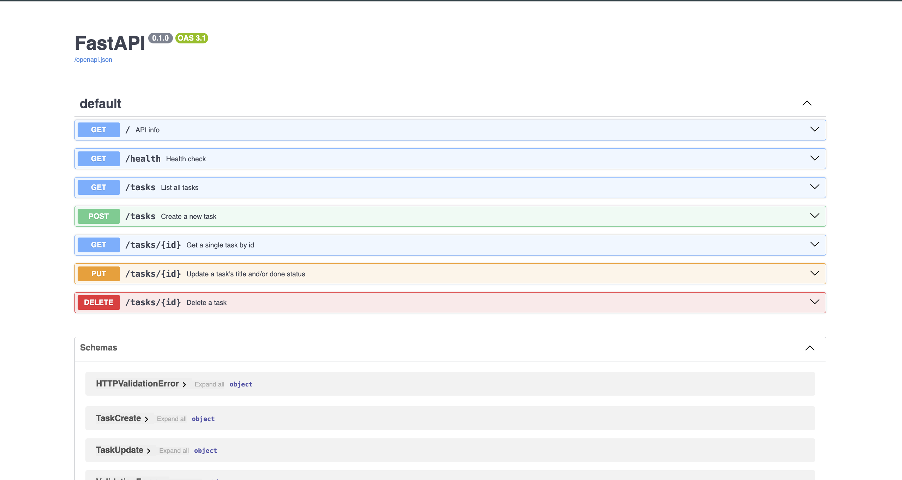

# Task API

A simple CRUD API for managing a to-do list, built with FastAPI as part of the FlyRank Backend Track internship (Week 2, Assignment A1). Tasks are stored in memory — data resets when the server restarts.

## How to run

Install dependencies: `pip install fastapi uvicorn`

Start the server: `uvicorn main:app --reload`

Server runs at `http://localhost:8000`. Interactive API docs available at `http://localhost:8000/docs`.

## Endpoints

| Method | Path          | Description                        |
|--------|---------------|-------------------------------------|
| GET    | `/`           | API info                           |
| GET    | `/health`     | Health check                       |
| GET    | `/tasks`      | List all tasks                     |
| GET    | `/tasks/{id}` | Get a single task by id            |
| POST   | `/tasks`      | Create a new task                  |
| PUT    | `/tasks/{id}` | Update a task's title/done status  |
| DELETE | `/tasks/{id}` | Delete a task                      |

## Example request

    curl -i -X POST http://localhost:8000/tasks -H "Content-Type: application/json" -d '{"title":"Buy milk"}'

    HTTP/1.1 201 Created
    content-type: application/json

    {"id":4,"title":"Buy milk","done":false}

## Swagger UI

## Notes

No database — tasks are stored in a Python list in memory. Restarting the server resets the data back to the 3 seed tasks. This is intentional for this stage of the project.